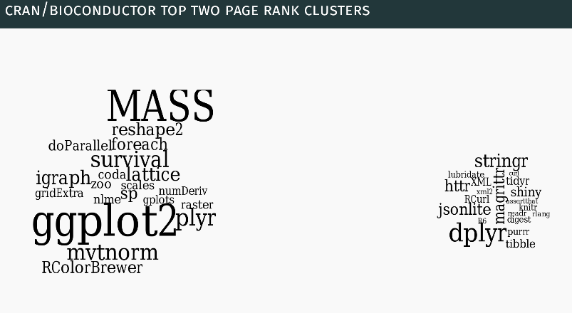
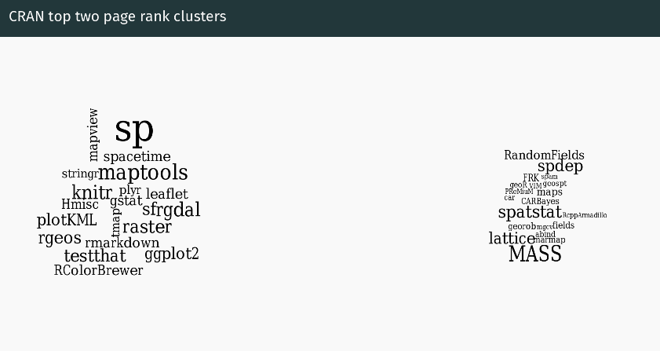
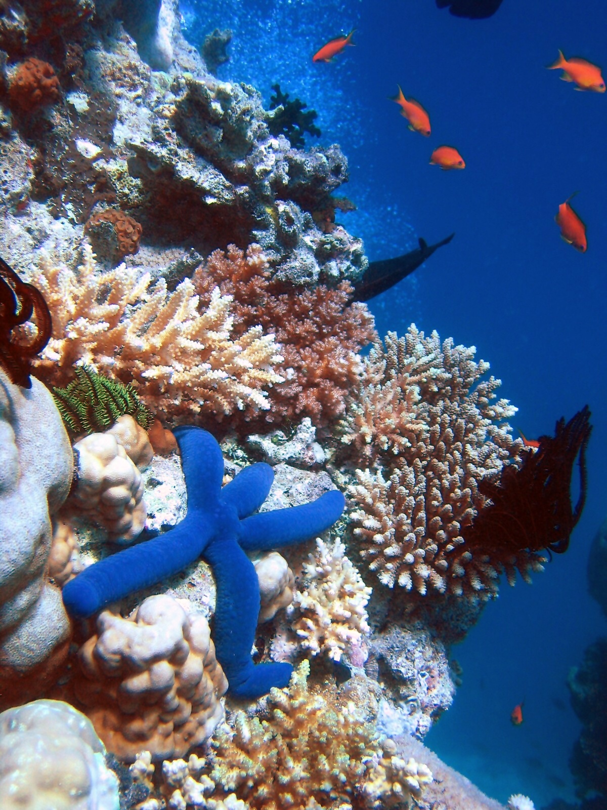
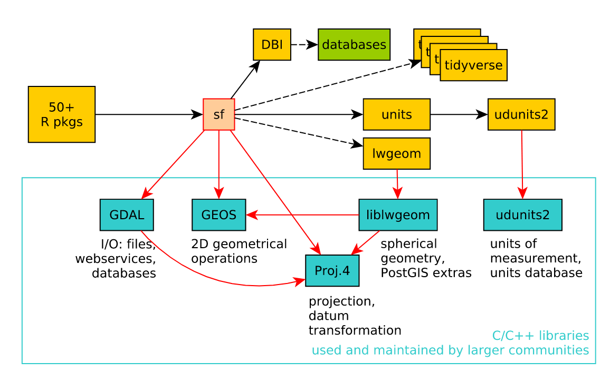

```{r setup, include=FALSE, purl=FALSE}
options(htmltools.dir.version = FALSE)
knitr::opts_chunk$set(fig.align = "center", cache = TRUE)
knitr::opts_chunk$set(root.dir = normalizePath("."))
```

class: inverse, left, bottom
# Ecosystem(s)

---
# Ecosystem(s)

```{r, echo=FALSE, purl=FALSE, out.width="80%", fig.cap="From Roger Bivand's slides 'A practical history of R'"}

```

---
# Ecosystem(s)

```{r, echo=FALSE, purl=FALSE, out.width="80%", fig.cap="From Roger Bivand's slides 'A practical history of R-sig-geo'"}

```

---
# Ecosystem(s)

.pull-left[
R packages:

- **sf**, **raster** - spatial classes
- **dplyr**, **rmapshaper** - processing of atttribute tables/geometries 
- **rnaturalearth**, **osmdata**, **getlandsat** - spatial data download
- **rgrass7**, **RQGIS**, **RSAGA**, **link2GI** - connecting with GIS software
- **gstat**, **mlr**, **CAST** - spatial data modeling
- **rasterVis**, **tmap**, **ggplot** - static visualizations
- **leaflet**, **mapview**, **mapdeck** - interactive visualizations
- many more...
]

.pull-right[
```{r, echo=FALSE, purl=FALSE, out.width="70%", eval=FALSE}

```
]

---
# Ecosystem(s)

.pull-left[
Spatial classes:

- **sf**
- **raster**
]

.pull-right[
Visualizations:

- **tmap**
]


---
# Ecosystem(s)

.pull-left[
Spatial classes:

- **sf**
- **raster**
- **sp**
- **stars**
- **terra**
- **spatial**
- ...
]

.pull-right[
Visualizations:

- **tmap**
- **ggplot** 
- **rasterVis**
- **leaflet**
- **mapview**
- **mapdeck**
- ...
]


---
# Ecosystem(s)

```{r, echo=FALSE, purl=FALSE, out.width="70%", fig.cap="Pebesma, Edzer. Simple features for R: standardized support for spatial vector data. The R Journal 10.1 (2018): 439-446."}

```


---
# Prerequisites

.pull-left[
We can install the packages used in the workshop as follows:

```{r, eval=FALSE}
pkgs = c(
  "sf",                
  "raster",            
  "dplyr",            
  "tmap",
  "spData",
  "usethis"
)
to_install = !pkgs %in% installed.packages()
if(any(to_install)) {
  install.packages(pkgs[to_install])
}
```
]

.pull-right[
The code below can be used to download all the scripts and data for the workshop:
```{r, eval=FALSE, purl=FALSE}
usethis::use_course("http://bit.ly/whyr19w")
```
]

---
# Exercises

1. Think about how R can help you? 
Why do you want to learn how to use it for spatial data analysis?
2. Have a look at [CRAN Task View: Analysis of Spatial Data](https://cran.r-project.org/web/views/Spatial.html) and check if there are any packages that may be useful to you in your daily work?

---
class: inverse, left, bottom
# Spatial data representation

---
# Spatial data representation

**sf**:
- The **sf** package is the successor of the **sp** package based on the OGC standard Simple Features.
- Combines the functionality of three previous packages: **sp**, **rgeos** and **rgdal**.
- Most of the functions in this package start with a prefix `st_`.
- This package handles additional vector data types (e.g. polygon and multipolygon are two separate classes), allows for easier data processing, and support sfor spatial databases such as PostGIS.
- https://r-spatial.github.io/sf/ and https://github.com/rstudio/cheatsheets/blob/master/sf.pdf

**raster**:
- The **raster** package contains classes and methods representing raster objects and operations.
- It allows raster data to be loaded and saved.
- It allows raster algebra and raster processing.
- It includes a number of additional functions, e.g. for analysis of terrain characteristics.
- It allows you to work on large sets of data.
- ?`raster-package` and http://www.rpubs.com/etiennebr/visualraster

---
# Spatial data reading - vector

.pull-left[
```{r}
library(sf)
poland = st_read("data/poland.gpkg")
```
- The `st_write()` function can be used for spatial vector data writing.
]

.pull-right[
```{r}
plot(poland)
```

]

---
# Spatial data structure - vector

```{r}
poland
```

---
# Spatial data reading - raster

.pull-left[
```{r, message=FALSE}
library(raster)
dem = raster("data/poland_srtm.tif")
```

- The `writeRaster()` function can be used for spatial raster data writing.
]

.pull-right[
```{r}
plot(dem)
```
]

---
# Spatial data structure - raster

```{r}
dem
```

---
# Exercises

1. Read the `data/wlkp_pn.gpkg` file containing the borders of the Wielkopolski National Park into R.
Display this object and view its structure.
What can you say about the contents of this file? 
What type of data does it store? 
What is the coordinate system used?
How many attributes does it contain?
What is its geometry?
2. Read the `data/wlkp_pn_dem.tif` file containing the digital elevation model for the Wielkopoland National Park area into R.
Display this object and view its structure.
What can you say about the contents of this file? 
What type of data does it store? 
What is the coordinate system used?
How many attributes does it contain?
How many dimensions does it have?
What is the data resolution?

---
class: inverse, left, bottom
# Spatial visualization

---
# Spatial visualization

```{r}
library(tmap)
```

- Thematic mapping package
- It allows you to create static maps, animated maps and interactive maps.
- It works by adding subsequent layers to visualize and then modifying them.
- https://github.com/mtennekes/tmap - list of additional materials about the **tmap** package 

---
# Spatial visualization

Open the `code/spatial_vis.R` file. 
Run the code and:

1. Change the map title from `"My map"` to `"New Zealand"`.
2. Update the map credits with your own name and today's date.
3. Change the color palette to `"BuGn"`. 
(You can also try other palettes from http://colorbrewer2.org/)
4. Put the north arrow in the top right corner of the map.
5. Improve the legend title by adding the legend units.
6. Increase the number of breaks in the scale bar.
7. Change the borders' color of the New Zealand's regions to black. 
Decrease the line width.
8. Change the background color to any color of your choice.

---
# Spatial visualization

.left-code[
```{r tm1, fig.show="hide"}
tm_shape(poland) + 
  tm_polygons()
```
]

.right-plot[
`)
]


---
# Spatial visualization

.left-code[
```{r tm2, fig.show="hide"}
tm_shape(poland) + 
  tm_polygons() + 
  tm_scale_bar(position = c("left", 
                            "bottom")) 
```
]

.right-plot[
`)
]

---
# Spatial visualization

.left-code[
```{r tm3, fig.show="hide"}
tm_shape(poland) + 
  tm_polygons() + 
  tm_scale_bar(position = c("left", 
                            "bottom")) + 
  tm_compass()
```
]

.right-plot[
`)
]

---
# Spatial visualization

.left-code[
```{r tm4, fig.show="hide"}
tm_shape(poland) + 
  tm_polygons() + 
  tm_scale_bar(position = c("left", 
                            "bottom")) + 
  tm_compass() +
  tm_layout(title = "Poland")
```
]

.right-plot[
`)
]

---
# Spatial visualization

```{r, eval=FALSE}
tmap_mode("view")
```

```{r, eval=FALSE}
tm_shape(poland) + 
  tm_polygons() + 
  tm_layout(title = "Poland")
```

```{r, eval=FALSE}
tmap_mode("plot")
```

---
# Spatial visualization

.left-code[

```{r tm5, fig.show="hide", message=FALSE}
tm_shape(dem) + 
  tm_raster()
```
]

.right-plot[
`)
]

---
# Spatial visualization

.left-code[
```{r tm6, fig.show="hide"}
tm_shape(dem) + 
  tm_raster(style = "cont",
            midpoint = NA)
```
]

.right-plot[
`)
]

---
# Spatial visualization

.left-code[
```{r tm7, fig.show="hide"}
tm_shape(dem) + 
  tm_raster(style = "cont", 
            midpoint = NA,
            palette = "-RdYlGn")
```
```{r, eval = FALSE}
tmaptools::palette_explorer()
```
]

.right-plot[
`)
]

---
# Spatial visualization

.left-code[
```{r tm8, fig.show="hide"}
tm_shape(dem) + 
  tm_raster(style = "fixed",
            breaks = c(-99, 0, 300,
                       600, 9999), 
            midpoint = NA,
            palette = "-RdYlGn",
            title = "") + 
  tm_layout(legend.position = c("LEFT", 
                                "BOTTOM"))
```
]

.right-plot[
`)
]


---
# Spatial visualization

.left-code[
```{r tm9, fig.show="hide"}
tm_shape(dem) + 
  tm_raster(style = "fixed",
            breaks = c(-99, 0, 300,
                       600, 9999), 
            labels = c("Depressions", 
                       "Plains", 
                       "Hills",
                       "Mountains"),
            midpoint = NA,
            palette = "-RdYlGn",
            title = "") + 
  tm_layout(legend.position = c("LEFT", 
                                "BOTTOM"))
```
]

.right-plot[
`)
]


---
# Spatial visualization

.left-code[
```{r tm10, fig.show="hide"}
tm_shape(dem) + 
  tm_raster(style = "fixed",
            breaks = c(-99, 0, 300,
                       600, 9999), 
            labels = c("Depressions", 
                       "Plains", 
                       "Hills",
                       "Mountains"),
            midpoint = NA,
            palette = c("#5E8B73",
                        "#DAE97A", 
                        "#EADC70", 
                        "#AF8D5C"),
            title = "") + 
  tm_layout(legend.position = c("LEFT",
                                "BOTTOM"))
```
]

.right-plot[
`)
]

---
# Spatial visualization

```{r}
map1 = tm_shape(dem) + 
  tm_raster(style = "fixed",
            breaks = c(-99, 0, 300, 600, 9999),
            labels = c("Depressions", "Plains", "Hills", "Mountains"),
            midpoint = NA, 
            palette = c("#5E8B73", "#DAE97A", "#EADC70", "#AF8D5C"),
            title = "") +
  tm_layout(legend.position = c("LEFT", "BOTTOM"))
```

```{r, eval=FALSE}
tmap_save(map1, "my_first_map.png")
```

---
# Exercises

1. Improve the `map1` object by e.g. adding a scale, north arrow, or title.
Also try to add the Polish border to this map.
2. Read the files `data/wlkp_pn.gpkg` and `data/wlkp_png_dem.tif` into R.
Create a map showing the terrain model for the Wielkopolski National Park area.
Save the obtained map to the file "WLKP_YOURNAME.png".
3. Save the creates map to the file "WLKP_YOURNAME.html". 
Open create file. 
How is it different from the ".png" file?
<!-- 3. Additionally, try repeating the steps in the article [Geocomputation with R: maps extended](https://geocompr.github.io/geocompkg/articles/maps.html) in order to make a hillshade map of Poland. -->


---
class: inverse, left, bottom
# Data manipulation

---
# Data manipulation

```{r}
library(dplyr)
```

- The **dplyr** package allows for easy processing of tabular data.
- Its capabilities include selecting specific columns or rows, adding new columns, or performing summaries.
- More information can be found at https://dplyr.tidyverse.org/ and https://r4ds.had.co.nz/transform.html

---
# Attributes manipulation

```{r, eval = FALSE}
meteo_data = read.csv("data/poland_meteo_2017.csv", encoding = "UTF-8")
head(meteo_data)
```

```{r, echo=FALSE, purl=FALSE}
meteo_data = read.csv("data/poland_meteo_2017.csv", encoding = "UTF-8")
knitr::kable(head(meteo_data), format = "html")
```

---
# Attributes manipulation

```{r, fig.height=3}
meteo_stations = st_read("data/poland_stacje.gpkg")
plot(st_geometry(meteo_stations))
```

---
# Attributes manipulation

```{r}
meteo_data_sel = meteo_data %>% 
  filter(Nazwa.stacji %in% unique(meteo_stations$NAZWA_ST))
```

```{r, echo=FALSE, purl=FALSE}
knitr::kable(head(meteo_data_sel), format = "html")
```

---
# Attributes manipulation

```{r}
meteo_data_sel = meteo_data %>% 
  filter(Nazwa.stacji %in% unique(meteo_stations$NAZWA_ST)) %>% 
  mutate(data = as.Date(paste0(Rok, "-", Miesiac, "-", Dzien)))
```

```{r, echo=FALSE, purl=FALSE}
knitr::kable(head(meteo_data_sel), format = "html")
```

---
# Attributes manipulation

```{r}
meteo_data_sel = meteo_data %>% 
  filter(Nazwa.stacji %in% unique(meteo_stations$NAZWA_ST)) %>% 
  mutate(data = as.Date(paste0(Rok, "-", Miesiac, "-", Dzien))) %>% 
  dplyr::select(-Rok, -Miesiac, -Dzien)
```

```{r, echo=FALSE, purl=FALSE}
knitr::kable(head(meteo_data_sel), format = "html")
```

---
# Attributes manipulation

```{r}
meteo_data_sel = meteo_data %>% 
  filter(Nazwa.stacji %in% unique(meteo_stations$NAZWA_ST)) %>% 
  mutate(data = as.Date(paste0(Rok, "-", Miesiac, "-", Dzien))) %>% 
  dplyr::select(-Rok, -Miesiac, -Dzien) %>% 
  summarize(tavg = mean(tavg), pressure = mean(pressure))
```

```{r, echo=FALSE, purl=FALSE}
knitr::kable(head(meteo_data_sel), format = "html")
```

---
# Attributes manipulation

```{r}
meteo_data_sel = meteo_data %>% 
  filter(Nazwa.stacji %in% unique(meteo_stations$NAZWA_ST)) %>% 
  mutate(data = as.Date(paste0(Rok, "-", Miesiac, "-", Dzien))) %>% 
  dplyr::select(-Rok, -Miesiac, -Dzien) %>% 
  group_by(Kod.stacji) %>% 
  summarize(tavg = mean(tavg), pressure = mean(pressure))
```

```{r, echo=FALSE, purl=FALSE}
knitr::kable(head(meteo_data_sel), format = "html")
```

---
# Attribute joining

```{r}
meteo = meteo_stations %>% 
  left_join(meteo_data_sel, by = c("KOD_SZS" = "Kod.stacji"))
```

```{r, echo=FALSE, purl=FALSE}
knitr::kable(head(meteo), format = "html")
```

---
# Attribute joining

```{r}
meteo = meteo_stations %>% 
  inner_join(meteo_data_sel, by = c("KOD_SZS" = "Kod.stacji"))
```

```{r, echo=FALSE, purl=FALSE}
knitr::kable(head(meteo), format = "html")
```

---
# Reprojections

.pull-left[
```{r}
plot(dem)
```
]

.pull-right[
```{r}
plot(st_geometry(meteo), axes = TRUE)
```
]

---
# Reprojections

```{r}
meteo = meteo_stations %>% 
  inner_join(meteo_data_sel, by = c("KOD_SZS" = "Kod.stacji")) %>% 
  st_transform(4326)
```

---
# Reprojections

```{r, message=FALSE, fig.height=5}
tm_shape(dem) +
  tm_raster() +
  tm_shape(meteo) +
  tm_symbols(col = "tavg", palette = "RdBu")
```

---
# Vector-raster interactions

```{r, out.width="100%"}
meteo$elev = extract(dem, meteo)
head(meteo)
```

---
# Vector-raster interactions

.pull-left[
```{r}
lc = raster("data/poland_lc.tif")
plot(lc)
```
]

.pull-right[
```{r}
wlkp_pn = st_read("data/wlkp_pn.gpkg", quiet = TRUE)
plot(st_geometry(wlkp_pn), axes = TRUE)
```
]

---
# Vector-raster interactions

```{r}
wlkp_pn_lc = crop(lc, wlkp_pn)
plot(wlkp_pn_lc)
```

---
# Vector-raster interactions

```{r}
wlkp_pn_lc2 = mask(wlkp_pn_lc, wlkp_pn)
plot(wlkp_pn_lc2)
```

---
# Exercises

1. Read the 2017 meteorological data and the location of the meteorological stations.
Create a spatial object containing all measurements for three stations: `BIAŁYSTOK`, `KRAKÓW-BALICE`, and `POZNAŃ`. (Tip: use the `right_join()` function.
2. Calculate the average temperature in January and July for these three stations.
3. Determine the land cover of the three stations.
4. Additional: improve the average temperature map presented in the "Reprojections" section.

<!-- 1. Select only the `name_long`, `continent`, and `pop` variables from the `world` object.  -->
<!-- 1. Find all countries with the following characteristics: -->
<!--     - Are in Africa. -->
<!--     - Have a population greater than 35 mln. -->
<!--     - Are in Africa and have a population greater than 35 mln. -->
<!-- 1. Additional: plot the results of Exercise 2. -->
<!-- 1. Create a new object, `world_pop_dens`, and add a new column `pop_dens` with a population density for each country. -->
<!-- 1. Calculate an average population density on the world and the continent level. -->
<!-- How can it be done? -->
<!-- 1. Create a map with three panels representing a population density on a (1) country, (2) continent, and (3) world level. -->

---
class: inverse, left, bottom
# Resources

---
# Resources

.pull-left[
- http://geocompr.github.io/ - Lovelace R., Nowosad J., Muenchow J. 2019, **Geocomputation with R**. CRC Press
- **sf** - https://r-spatial.github.io/sf/
- **raster** - https://rspatial.org/spatial/index.html
- **tmap** - https://github.com/mtennekes/tmap
- **dplyr** - http://r4ds.had.co.nz/ - Wickham H., Goremund G. 2016. **R for Data Science**. O'Reilly Media
]

.pull-right[
- Blogs (e.g., https://www.r-bloggers.com/, https://rweekly.org/)
- Websites (e.g., https://gis.stackexchange.com/, https://stat.ethz.ch/mailman/listinfo/r-sig-geo)
- Twitter `#rspatial`, `#geocompr`
- Meetups
]

---
class: center, middle, clear

.pull-right[
## About me:

Twitter: `r icon::ii_social_twitter()` jakub_nowosad

Email: nowosad.jakub@gmail.com

https://nowosad.github.io

https://geocompr.github.io/
]

